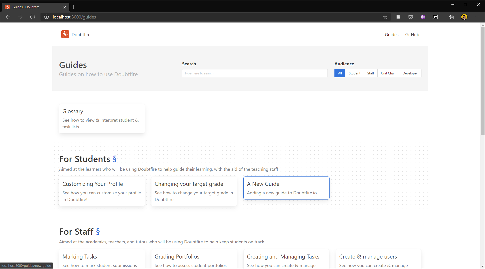
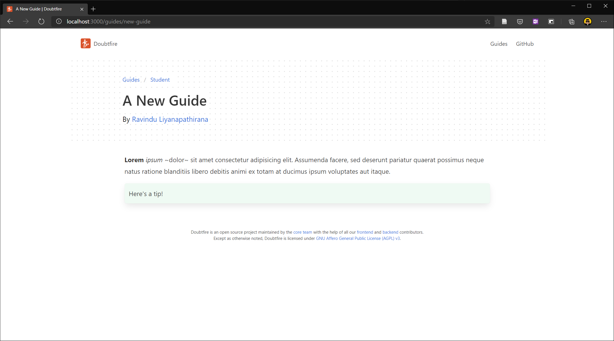

# Contributing

This is a,

- [TypeScript](https://www.typescriptlang.org/)-based
- [Next.js](https://nextjs.org/) (i.e. [React](https://reactjs.org/)-based) static website bootstrapped with
  [`create-next-app`](https://create-next-app.js.org/). View the docs at [nextjs.org/docs](https://nextjs.org/docs/).

that uses,

- [Bulma](https://bulma.io/) as the (only) frontend framework
- [SCSS](https://sass-lang.com/) for styling
- [unified](https://unifiedjs.com/) for processing markup
- [Prettier](https://prettier.io/) for formatting code
- [ESLint](https://eslint.org/) for linting code

## Project Structure

- `components/`: Reusable React components.
- `guides/`: Contains Doubtfire user guides.
  - `[aud]/`: Guides for the audience identified by `aud`.
    - `[id].md`: Markdown file that contains the content of the guide identified by `id`.
  - `Meta.ts`: Global metadata about guides.
- `pages/`: Next.js pages directory.
  - `_app.tsx`, `_document.tsx`: Custom Next.js [App](https://nextjs.org/docs/advanced-features/custom-app) and
    [Document](https://nextjs.org/docs/advanced-features/custom-document).
  - `_app.scss`: [Global styles](https://nextjs.org/docs/basic-features/built-in-css-support).
  - [Pages](https://nextjs.org/docs/basic-features/pages) of the website.
- `public/`: Contains assets.
  - `guides/`: Contains assets relevant to guides.
    - `[id]/`: Contains assets relevant to the guide identified by `id`.

## Prerequisites

1. [Node.js](https://nodejs.org/) `>= 14.x`.
1. [Visual Studio Code](https://code.visualstudio.com/) with the following plugins,
   1. [EditorConfig for VS Code](https://marketplace.visualstudio.com/items?itemName=EditorConfig.EditorConfig)
   1. [ESLint](https://marketplace.visualstudio.com/items?itemName=dbaeumer.vscode-eslint)
   1. [Prettier - Code formatter](https://marketplace.visualstudio.com/items?itemName=esbenp.prettier-vscode)
   1. [Markdown All in One](https://marketplace.visualstudio.com/items?itemName=yzhang.Markdown-all-in-one)
      (recommended)
   1. [Code Spell Checker](https://marketplace.visualstudio.com/items?itemName=streetsidesoftware.code-spell-checker)
      (recommended)
   1. [TODO Highlight](https://marketplace.visualstudio.com/items?itemName=wayou.vscode-todo-highlight) (recommended)

## Code Style

The project includes [EditorConfig](.editorconfig), [Prettier](.prettierrc.js), [ESLint](.eslintrc.js) and
[VSCode Workspace](.vscode/settings.json) configurations. VSCode, when configured with the
[prerequisite](#prerequisites) should automatically,

- Handle code formatting (of TypeScript, JavaScript and Markdown files) upon saving.
- Highlight any issues that the linter reveals.
- Highlight misspelled words.
- Type-check TypeScript sources.

If not using the tools recommended above,

- Use a [EditorConfig](https://editorconfig.org/)-compliant text editor.
- Use the `pretty:check` and `pretty:write` NPM scripts to format the codebase according to the
  [code style](#code-style).
- Use the `lint` NPM script to run ESLint and fix any errors that it reveals before committing your changes.

## Getting Started

1. Clone this repository, and `cd` into it.
1. Run `npm install` to install dependencies.

### Development

1. Run `npm run dev` to launch the Next.js development server, which should serve the website locally. A `localhost` URL
   will be logged to the console.
1. Visit the URL in a web browser.
1. Any subsequent changes to the TypeScript, React & SCSS sources of the website will cause the webpage to instantly
   refresh its content.

The console session should look something like,

```
PS> npm run dev

> doubtfire.io@0.1.0 dev doubtfire.io
> next dev

ready - started server on http://localhost:3000
event - compiled successfully
event - build page: /
wait  - compiling...
event - build page: /next/dist/pages/_error
event - compiled successfully
```

### Publishing to GitHub Pages

The [`pages`](.github/workflows/pages.yml) workflow is configured to build, export & push the website to GitHub Pages
(i.e. the [`gh-pages`](https://github.com/RavinduL/doubtfire.io/tree/gh-pages) branch).

To trigger this workflow,

- (Preferred) Either push commits to the [`pages`](https://github.com/RavinduL/doubtfire.io/tree/pages) branch.
- Or, manually trigger the workflow via [GitHub Actions](https://github.com/RavinduL/doubtfire.io/actions).

### Authoring a Guide

1. **Decide on the name, ID, and audience of the guide.** <br> The ID must be unique across _all guides_, not just those
   within its audience. The `Audience` type exported by [`guides/Meta.ts`](guides/Meta.ts) defines the possible values
   for the audience.

   <details><summary>Example</summary>

   For the purposes of this example, the following details will be used,

   - **Name:** A New Guide
   - **ID:** `new-guide`
   - **Audience:** `student`

   </details>

1. **Add the guide to the `orderedGuides` list of [`Meta.ts`](guides/Meta.ts)**. <br> This list defines the order in
   which the guide will be listed.

   <details><summary>Example</summary>

   ```typescript
   orderedGuides: [
     ...
     'new-guide'
     ...
   ]
   ```

   </details>

1. **Create a Markdown file for the content of the guide.** <br> The file must be created within the `guides/[audience]`
   directory and must be named after the ID of the guide.

   <details><summary>Example</summary>

   In this case, the file will be `guides/student/new-guide.md`.

   </details>

1. **Add front matter to the guide.** <br> The `RawGuideFrontMatter` type exported by [`guides/Meta.ts`](guides/Meta.ts)
   defines the front matter expected to be defined on each guide.

   - The `title`, `summary` and `authors` fields are expected.
   - `authors` is a comma-delimited sequence of GitHub usernames (e.g. `author1, author2` for two authors). These
     usernames can optionally be mapped to their names within the `authorNames` property of the default export of
     [`guides/Meta.ts`](guides/Meta.ts).

   <details><summary>Example</summary>

   In this case, the front matter of the guide would be,

   ```
   ---
   title: A New Guide
   summary: Adding a new guide to Doubtfire.io
   authors: RavinduL
   ---
   ```

   The author name can be specified as,

   ```typescript
   authorNames: {
     ...
     RavinduL: 'Ravindu Liyanapathirana',
   }
   ```

   </details>

1. **Author the content of the guide.** <br> The content will be in the markdown format, and must be typed below the
   front matter.

   - View the Markdown documentation at
     [daringfireball.net/projects/markdown](https://daringfireball.net/projects/markdown/). Markdown content can include
     HTML where necessary.

   - The following markdown extensions can also be used,

     ```
     !> A tip
     ```

     ```
     ?> A warning
     ```

     ```
     x> An error
     ```

   - The contents of guides do not get automatically refresh upon saving, unlike TypeScript, React & SCSS sources.
     Manual reloading is therefore required to view changes.

   - Any images that have to be included in the guide must be placed in the [`public/guides/[id]/`](public/guides)
     directory (with `[id]` substituted with the guide ID).

   - CSS classes from the [Bulma](https://bulma.io/) frontend framework can be used for formatting where necessary.

   <details><summary>Example</summary>

   In this case, the contents of the entire Markdown file (i.e. with the front matter) will be,

   ```
   ---
   title: A New Guide
   summary: Adding a new guide to Doubtfire.io
   authors: RavinduL
   ---

   **Lorem** _ipsum_ ~dolor~ sit amet consectetur adipisicing elit. Assumenda facere, sed deserunt pariatur quaerat
   possimus neque natus ratione blanditiis libero debitis animi ex totam at ducimus ipsum voluptates aut itaque.

   !> Here's a tip!

   ```

   Images must be uploaded to the directory `public/guides/new-guide/`.

   </details>

- The new guide should appear on the website after a refresh.

  <details><summary>Example</summary>

  

  

  </details>
